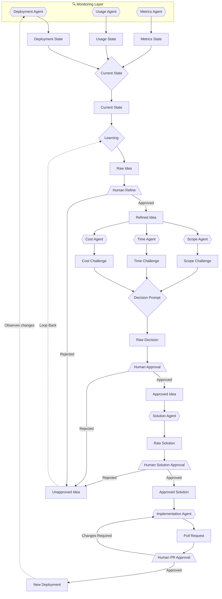

# Agent Flow Architecture

## Legend
- `{{Agent}}` = Hexagon = Agent
- `{Prompt}` = Diamond = Prompt
- `[Topic/State]` = Rectangle = Topic/Data Entity
- `[/Human\]` = Parallelogram = Human in the Loop

## Architecture Layers

### 1. Monitoring Layer (Entry Point)
The monitoring layer continuously observes the platform and publishes state to Kafka topics:

- **Deployment Agent**: Discovers infrastructure state from Confluent Cloud
  - Uses MCP (Model Context Protocol) to query topics, schemas, connectors
  - Analyzes domain boundaries based on schema namespaces
  - Publishes to `agent-state-deployment` topic

- **Usage Agent**: Tracks consumption patterns and data usage
  - Monitors consumer groups and consumption rates
  - Identifies idle topics and high-traffic topics
  - Publishes to `agent-state-usage` topic

- **Metrics Agent**: Monitors system health and performance
  - Tracks throughput, latency, error rates
  - Detects consumer lag and bottlenecks
  - Publishes to `agent-state-metrics` topic

### 2. Current State Aggregation
**Current State** synthesizes the three monitoring states:
- Consumes from `agent-state-deployment`, `agent-state-usage`, `agent-state-metrics`
- Uses Claude to generate human-readable summary and insights
- Publishes aggregated view to `agent-state-current` topic
- This becomes the input for ideation

### 3. Ideation Layer
**Learning Agent** reads current state and generates improvement ideas:
- Analyzes platform state for opportunities
- Proposes data products, optimizations, governance improvements
- Human refines/approves/rejects ideas

### 4. Evaluation Layer
Three specialized agents challenge approved ideas:
- **Scope Agent**: Assesses complexity and scope creep risks
- **Time Agent**: Estimates timeline and schedule risks
- **Cost Agent**: Analyzes resource and cost implications

### 5. Decision & Execution
- **Decision Prompt**: Synthesizes challenges into recommendation
- **Human Approval**: Final go/no-go decision
- **Solution Agent**: Designs detailed implementation
- **Implementation Agent**: Writes code and creates PR
- **Human PR Approval**: Reviews before deployment

### 6. Feedback Loop
New deployments are observed by monitoring agents, updating Current State and enabling continuous improvement.
