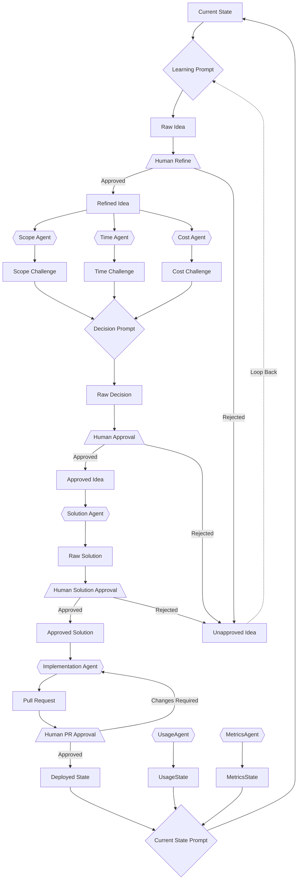

# Agent Flow Architecture

```mermaid
flowchart TD
    %% Ideation Flow starts with Current State
    CurrentState[Current State] --> LearningPrompt{Learning Prompt}
    LearningPrompt --> RawIdea[Raw Idea]
    RawIdea --> HumanRefine[/Human Refine\]

    %% Early Approval Path
    HumanRefine -->|Approved| RefinedIdea[Refined Idea]
    HumanRefine -->|Rejected| UnapprovedIdea[Unapproved Idea]

    %% Evaluation Agents
    RefinedIdea --> ScopeAgent{{Scope Agent}}
    RefinedIdea --> TimeAgent{{Time Agent}}
    RefinedIdea --> CostAgent{{Cost Agent}}

    ScopeAgent --> ScopeChallenge[Scope Challenge]
    TimeAgent --> TimeChallenge[Time Challenge]
    CostAgent --> CostChallenge[Cost Challenge]

    %% Decision
    ScopeChallenge --> DecisionPrompt{Decision Prompt}
    TimeChallenge --> DecisionPrompt
    CostChallenge --> DecisionPrompt

    DecisionPrompt --> RawDecision[Raw Decision]
    RawDecision --> HumanApproval[/Human Approval\]

    %% Final Approval Paths
    HumanApproval -->|Approved| ApprovedIdea[Approved Idea]
    HumanApproval -->|Rejected| UnapprovedIdea
    UnapprovedIdea -.->|Loop Back| LearningPrompt

    %% Solution Design
    ApprovedIdea --> SolutionAgent{{Solution Agent}}
    SolutionAgent --> RawSolution[Raw Solution]
    RawSolution --> HumanSolutionApproval[/Human Solution Approval\]

    %% Solution Approval Paths
    HumanSolutionApproval -->|Approved| ApprovedSolution[Approved Solution]
    HumanSolutionApproval -->|Rejected| UnapprovedIdea

    %% Implementation
    ApprovedSolution --> ImplAgent{{Implementation Agent}}
    ImplAgent --> PullRequest[Pull Request]
    PullRequest --> HumanPRApproval[/Human PR Approval\]

    %% Deployment Approval Paths
    HumanPRApproval -->|Approved| DeployedState[Deployed State]
    HumanPRApproval -->|Changes Required| ImplAgent

    %% Monitoring (outside main flow)
    UsageAgent{{UsageAgent}} --> UsageState[UsageState]
    MetricsAgent{{MetricsAgent}} --> MetricsState[MetricsState]

    %% Current State Aggregation
    DeployedState --> CurrentStatePrompt{Current State Prompt}
    UsageState --> CurrentStatePrompt
    MetricsState --> CurrentStatePrompt

    CurrentStatePrompt --> CurrentState[Current State]
```

## Legend
- `{{Agent}}` = Hexagon = Agent
- `{Prompt}` = Diamond = Prompt
- `[Topic]` = Rectangle = Topic/Data Entity
- `[/Human\]` = Parallelogram = Human in the Loop
